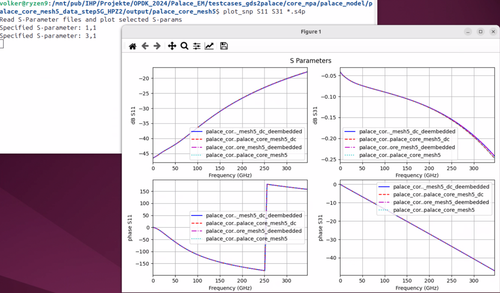

# plot_snp

plot_snp reads one or more S-parameter files with any number of ports (*.snp) 
and plots magnitude (dB) and phase of all selected parameters.

To run the inductor plot and analysis, specify the *.snp file(s) and the requested S-parameters as commandline parameter. Order does not matter. Default is S11.

example:
```
python plot_snp.py data.s2p S21 

python plot_snp.py measured.s2p simulated.s2p S11 S21

```

The tool plots all files with the specified parameter(s)




# Prerequisites
The code requires Python3 with the skitkit-rf library.
https://scikit-rf.readthedocs.io/en/latest/tutorials/index.html


